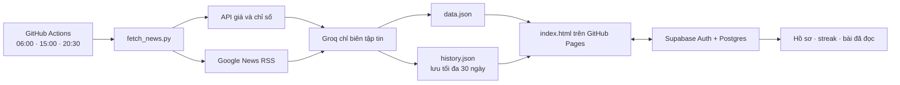

# Tài liệu website The Daily Edge

> Tài liệu tổng hợp về chức năng, kiến trúc, nguồn dữ liệu, cách cài đặt, vận hành và xử lý lỗi.
>
> Cập nhật: 11/08/2026 · Múi giờ vận hành: `Asia/Ho_Chi_Minh`

## 1. Website này dùng để làm gì?

**The Daily Edge** là website bản tin cá nhân, tự động tổng hợp các nội dung:

- Tài chính vĩ mô: FED, CPI Mỹ, lãi suất và thị trường quốc tế.
- Thị trường Việt Nam: VN-Index, USD/VND, NHNN và FDI.
- Trí tuệ nhân tạo: OpenAI, Anthropic, Gemini, mô hình và chip AI.
- Logistics Việt Nam và thế giới.
- Chuyên mục đầu tư:
  - Tổng hợp đầu tư.
  - Vàng.
  - Bạc.
  - Cổ phiếu Việt Nam: VN-Index và VN30.
  - Bất động sản TP.HCM.
- Phân tích xu hướng ngắn hạn và dài hạn bằng AI.
- Streak truy cập và danh sách bài đã đọc/chưa đọc trên nhiều thiết bị.

Website chính được xuất bản bằng **GitHub Pages**:

<https://khoadinh-lab.github.io/My-daily-finance-and-AI-news/>

Kho mã nguồn:

<https://github.com/KhoaDinh-lab/My-daily-finance-and-AI-news>

## 2. Cách toàn bộ hệ thống hoạt động



Quy trình đơn giản:

1. GitHub Actions khởi chạy `fetch_news.py` đúng giờ hoặc khi người quản trị bấm chạy thủ công.
2. Python lấy giá, chỉ số và tiêu đề tin từ các nguồn công khai.
3. Groq chọn các tin đáng chú ý, dịch tiêu đề và tóm tắt sang tiếng Việt.
4. Chương trình kiểm tra JSON, đường dẫn nguồn, thời gian và các trường bắt buộc.
5. Dữ liệu hợp lệ mới được ghi vào `data.json` và `history.json`.
6. GitHub Actions tự commit hai tệp dữ liệu lên nhánh `main`.
7. GitHub Pages phân phối website mới tới trình duyệt.
8. Supabase lưu riêng streak và trạng thái đã đọc của từng tài khoản.

## 3. Cấu trúc các tệp quan trọng

| Tệp/thư mục | Công dụng |
|---|---|
| `index.html` | Toàn bộ giao diện, điều hướng, đăng nhập, đọc dữ liệu và tương tác người dùng. |
| `fetch_news.py` | Bộ máy lấy dữ liệu, lấy RSS, gọi Groq, kiểm tra và tạo JSON. |
| `data.json` | Bản dữ liệu hiện tại mà website đang hiển thị. |
| `history.json` | Kho bài cũ tối đa 30 ngày, dùng cho mục Bỏ lỡ và phân tích xu hướng. |
| `.github/workflows/update.yml` | Lịch tự động và các bước chạy trên GitHub Actions. |
| `requirements.txt` | Thư viện Python cần cài; hiện tại chủ yếu là `groq`. |
| `supabase/migrations/...sql` | Cấu trúc cơ sở dữ liệu, hàm streak và chính sách bảo mật RLS. |
| `manifest.webmanifest` | Thông tin cài website như một ứng dụng PWA. |
| `sw.js` | Bộ nhớ đệm và chế độ dự phòng khi mạng yếu. |
| `assets/` | Logo và hình ảnh của website. |

Đây là website tĩnh, không cần máy chủ riêng để hiển thị nội dung. Python chỉ chạy trong GitHub Actions để tạo tệp JSON mới.

## 4. Các trang và chức năng đang có

### 4.1 Tổng quan

- Lời chào theo buổi và tên tài khoản.
- Streak hiện tại, kỷ lục và số bài chưa đọc.
- Các chỉ số nổi bật như FED, CPI, VN-Index và USD/VND.
- Các bài nổi bật từ mọi chuyên mục.

### 4.2 Vĩ mô, Việt Nam, AI và Logistics

- Ban đầu chỉ hiện tiêu đề, nhãn, nguồn và thời gian.
- Khi nhấn vào bài, website mở phần nội dung lớn giống một trang Notion.
- Bài được đánh dấu đã đọc và đồng bộ sang Supabase.
- Tiêu đề tiếng Anh được Groq chuyển sang tiếng Việt.

### 4.3 Chuyên mục Đầu tư

Khi đưa chuột hoặc nhấn vào **Đầu tư**, menu con gồm:

- Tổng hợp đầu tư.
- Vàng.
- Bạc.
- Cổ phiếu Việt Nam.
- Bất động sản.

Trang tổng hợp giúp so sánh nhanh các nhóm tài sản trong cùng một khung nhìn.

### 4.4 Vàng và Bạc

Hiển thị:

- Giá quốc tế theo `USD/oz`.
- Giá đóng cửa phiên liền trước.
- Mức tăng/giảm tuyệt đối và phần trăm.
- Hướng tăng, giảm hoặc đi ngang.
- Thời gian nguồn cập nhật.
- Quy đổi tham khảo:
  - Vàng: triệu đồng/lượng, dùng 1 lượng = 37,5 gram.
  - Bạc: triệu đồng/kg.

**Lưu ý:** đây là giá chuẩn quốc tế COMEX và phép quy đổi tham khảo. Nó không phải giá mua/bán SJC, chưa bao gồm chênh lệch trong nước, thuế hoặc phí.

### 4.5 Cổ phiếu Việt Nam

- VN-Index.
- VN30.
- Điểm phiên hiện tại.
- Điểm phiên liền trước.
- Số điểm và phần trăm tăng/giảm.
- Tin thị trường chứng khoán Việt Nam mới nhất.

VN30 lấy từ TradingView và có thể trễ khoảng 15 phút.

### 4.6 Bất động sản

- Mốc tham khảo căn hộ sơ cấp khu trung tâm TP.HCM.
- Rổ dự án đại diện tại Tân Phú, Quận 7, Thủ Đức và Bình Thạnh.
- Phân nhóm hạng thường, trung cấp, cao cấp và hạng sang.
- Giá phổ biến mỗi căn, giá/m², khoảng giá và thay đổi theo nguồn.
- Khoảng giá tham khảo nhà riêng và đất tại một số khu vực.

Hệ thống kiểm tra giá dự án **một lần mỗi ngày**. Nếu OneHousing tạm không đọc được, nó giữ số liệu gần nhất và đánh dấu dữ liệu dự phòng, thay vì xóa toàn bộ bảng giá.

Giá bất động sản là giá tham khảo/tin rao hoặc giá phổ biến của rổ mẫu, không phải giá giao dịch công chứng và không phải định giá tài sản.

### 4.7 Xu hướng

- Dùng các bài trong 7 ngày gần nhất.
- Phân tích riêng Vĩ mô, Việt Nam, AI và Logistics.
- Có góc nhìn ngắn hạn `1–4 tuần`.
- Có kịch bản dài hạn `3–12 tháng`.
- Hiển thị độ tin cậy, động lực và nội dung cần theo dõi tiếp theo.

Nếu AI phân tích xu hướng bị lỗi, website giữ bản phân tích cũ hoặc tạo trạng thái “chưa đủ dữ liệu”. Lỗi trend không làm hỏng lần cập nhật tin chính.

### 4.8 Bài bỏ lỡ và streak

- Mỗi bài có một ID ổn định được tạo từ đường dẫn nguồn.
- Khi người dùng mở bài, ID được lưu trong bảng `article_reads`.
- Mục Bỏ lỡ lọc các bài chưa có trong danh sách đã đọc.
- Các bài được chia theo chuyên mục để dễ tìm.
- Mỗi ngày truy cập được ghi vào `daily_visits` theo giờ Việt Nam.
- Streak được tính từ chuỗi ngày truy cập liên tiếp.

Nếu Supabase tạm lỗi, trình duyệt dùng `localStorage` làm phương án dự phòng. Khi Supabase hoạt động lại, dữ liệu được đồng bộ lên tài khoản.

### 4.9 Tài khoản

- Người dùng có thể tạo tài khoản bằng tên hiển thị, email và mật khẩu.
- Supabase Auth quản lý đăng ký, đăng nhập và phiên truy cập.
- `profiles` giữ tên hiển thị.
- Mỗi tài khoản chỉ được đọc/sửa dữ liệu của chính mình nhờ Row Level Security.
- Publishable key trong `index.html` được thiết kế để dùng ở trình duyệt. Tuyệt đối không đặt `service_role` key hoặc khóa bí mật vào HTML.

## 5. Dữ liệu được lấy từ đâu?

### 5.1 Bảng nguồn dữ liệu

| Nội dung | Nguồn | Cách lấy | Vai trò |
|---|---|---|---|
| Tiêu đề tin | [Google News RSS](https://news.google.com/) | RSS tìm kiếm theo chủ đề và thời gian | Cung cấp tiêu đề gốc, hãng tin, link và giờ đăng. |
| CPI Mỹ | [U.S. Bureau of Labor Statistics](https://www.bls.gov/cpi/) | BLS Public Data API, series `CUUR0000SA0` | Tính lạm phát cùng kỳ năm. |
| CPI dự phòng | [FRED](https://fred.stlouisfed.org/) | CSV series `CPIAUCSL` | Chỉ dùng nếu BLS tạm lỗi. |
| USD/VND | [ExchangeRate-API](https://www.exchangerate-api.com/) | Endpoint công khai `open.er-api.com` | Tỷ giá tham khảo và quy đổi kim loại. |
| VN-Index | [Yahoo Finance](https://finance.yahoo.com/quote/%5EVNINDEX.VN/) | Chart API, mã `^VNINDEX.VN` | Điểm hiện tại, phiên trước và phần trăm thay đổi. |
| VN30 | [TradingView](https://www.tradingview.com/symbols/HOSE-VN30/) | Public scanner, mã `HOSE:VN30` | Điểm, thay đổi và thời gian cập nhật. |
| Vàng | [Yahoo Finance](https://finance.yahoo.com/quote/GC%3DF/) | Chart API, hợp đồng `GC=F` | Giá vàng COMEX theo USD/oz. |
| Bạc | [Yahoo Finance](https://finance.yahoo.com/quote/SI%3DF/) | Chart API, hợp đồng `SI=F` | Giá bạc COMEX theo USD/oz. |
| Dự án căn hộ | [OneHousing](https://onehousing.vn/) | Đọc trang phân tích từng dự án | Giá phổ biến, giá/m² và khoảng giá. |
| Mốc căn hộ TP.HCM | One Mount Group/OneHousing | Báo cáo thị trường PDF | Benchmark căn hộ sơ cấp khu trung tâm. |
| Nhà riêng và đất | [Batdongsan.com.vn](https://batdongsan.com.vn/) | Khoảng khảo sát tin rao đã lưu kèm ngày nguồn | So sánh tham khảo theo khu vực. |
| Biên tập và trend | [Groq](https://console.groq.com/) | Groq API | Chọn tin, dịch, tóm tắt và phân tích xu hướng. |

### 5.2 Truy vấn tin theo chuyên mục

Chương trình ưu tiên tin mới trong khoảng 2–3 ngày:

- Vĩ mô: Federal Reserve, Fed, US CPI, US inflation.
- Việt Nam: VN-Index, USD/VND, NHNN, FDI Việt Nam.
- AI: OpenAI, Anthropic, Gemini, AI model, AI chip.
- Logistics Việt Nam: cảng biển, chuỗi cung ứng, vận tải hàng hóa.
- Logistics thế giới: global logistics, shipping, freight, supply chain.
- Vàng: giá vàng, vàng SJC, gold market, central bank gold.
- Bạc: giá bạc, silver market, industrial silver.
- Cổ phiếu: VN30, VN-Index, cổ phiếu và chứng khoán Việt Nam.
- Bất động sản: giá căn hộ, nhà ở, pháp lý và hạ tầng TP.HCM.

Google News RSS là bộ gom nguồn. Bài có thể đến từ Reuters, Bloomberg, báo Việt Nam hoặc một tòa soạn khác tùy kết quả tìm kiếm tại thời điểm chạy.

### 5.3 AI được phép và không được phép làm gì?

Groq hiện thử lần lượt các model:

1. `llama-3.3-70b-versatile`.
2. `openai/gpt-oss-20b` nếu model đầu tạm lỗi.

Phân tích trend có thêm model dự phòng `llama-3.1-8b-instant`.

AI được dùng để:

- Chọn tối đa 3 tin đáng chú ý cho mỗi chuyên mục.
- Dịch tiêu đề sang tiếng Việt tự nhiên.
- Tóm tắt 2–3 câu.
- Gắn nhãn chủ đề.
- Phân tích xu hướng từ kho bài đã lưu.

AI không được dùng để:

- Tự tạo đường dẫn bài báo.
- Tự tạo giờ đăng hoặc tên nguồn.
- Thay đổi CPI, USD/VND, VN-Index, VN30, Vàng hoặc Bạc lấy từ API.
- Thêm một bài không tồn tại trong danh sách RSS.

Sau khi AI chọn bài bằng `source_index`, Python gắn lại URL, nguồn và giờ đăng từ RSS gốc. Nếu dữ liệu thiếu trường bắt buộc, lần cập nhật bị dừng và không ghi đè dữ liệu tốt đang có.

FED rate hiện chỉ được điền khi quy trình biên tập tìm thấy thông tin đủ tin cậy trong nguồn mới. Nếu không chắc chắn, website hiển thị **“Chưa có dữ liệu”** thay vì đoán số.

## 6. Lịch cập nhật

GitHub Actions dùng giờ UTC, nhưng lịch đã được quy đổi sang giờ Việt Nam:

| Giờ Việt Nam | Cron UTC | Mục đích |
|---|---|---|
| 06:00 | `0 23 * * *` | Bản tin đầu ngày. |
| 15:00 | `0 8 * * *` | Cập nhật giữa/cuối phiên Việt Nam. |
| 20:30 | `30 13 * * *` | Bản tổng hợp buổi tối. |

Ngoài ba mốc trên, người quản trị có thể chạy bất kỳ lúc nào:

1. Mở trang [Auto Fetch News](https://github.com/KhoaDinh-lab/My-daily-finance-and-AI-news/actions/workflows/update.yml).
2. Nhấn **Run workflow**.
3. Chọn nhánh `main`.
4. Nhấn **Run workflow** lần nữa.
5. Đợi dấu tròn chuyển thành dấu tích xanh.

Nút làm mới trên website không chứa khóa bí mật và không trực tiếp gọi Groq từ trình duyệt. Nó hướng dẫn người quản trị mở GitHub Actions và theo dõi thời điểm `data.json` đổi mới.

## 7. Cách dựng lại website từ đầu

### Bước 1: Chuẩn bị tài khoản

Cần có:

- Tài khoản GitHub.
- Tài khoản Groq để tạo API key.
- Tài khoản Supabase nếu muốn đăng nhập và đồng bộ nhiều thiết bị.

### Bước 2: Đưa mã nguồn lên GitHub

Có thể fork repository hiện tại hoặc tạo repository mới rồi tải các tệp lên. Nhánh dùng để phát hành trong dự án này là `main`.

### Bước 3: Tạo `GROQ_API_KEY`

1. Truy cập <https://console.groq.com/>.
2. Đăng nhập.
3. Mở phần **API Keys**.
4. Chọn **Create API Key**.
5. Sao chép key và cất ở nơi an toàn.

Không dán key vào `fetch_news.py`, `index.html`, `data.json` hoặc bất kỳ tệp nào được đẩy lên GitHub.

Thêm key vào GitHub:

1. Repository → **Settings**.
2. **Secrets and variables** → **Actions**.
3. **New repository secret**.
4. Name: `GROQ_API_KEY`.
5. Secret: dán key Groq.

### Bước 4: Bật GitHub Pages

1. Repository → **Settings** → **Pages**.
2. Source: **Deploy from a branch**.
3. Branch: `main`.
4. Folder: `/ (root)`.
5. Nhấn **Save**.

Sau vài phút, GitHub cung cấp địa chỉ dạng:

```text
https://TEN-TAI-KHOAN.github.io/TEN-REPOSITORY/
```

### Bước 5: Tạo Supabase project

1. Truy cập <https://supabase.com/dashboard>.
2. Tạo project mới.
3. Mở **SQL Editor**.
4. Chạy toàn bộ migration trong:

```text
supabase/migrations/20260810054100_create_user_reading_sync.sql
```

Migration tạo:

- `profiles`: tên hiển thị.
- `daily_visits`: ngày truy cập và streak.
- `article_reads`: bài đã đọc.
- Trigger tự tạo profile sau đăng ký.
- Hàm `record_daily_visit()`.
- RLS để mỗi người chỉ thấy dữ liệu của mình.

Sau đó mở Supabase → **Project Settings** → **API** và lấy:

- Project URL.
- Publishable/anon key.

Thay hai giá trị tương ứng ở đầu JavaScript trong `index.html`:

```js
const SUPABASE_URL = "https://YOUR-PROJECT.supabase.co";
const SUPABASE_PUBLISHABLE_KEY = "YOUR-PUBLISHABLE-KEY";
```

Chỉ dùng publishable/anon key. Không bao giờ dùng service-role key trong trình duyệt.

### Bước 6: Cấu hình Supabase Auth

Trong Supabase → **Authentication** → **URL Configuration**:

- Site URL: URL GitHub Pages của bạn.
- Redirect URLs: thêm URL GitHub Pages, có thể thêm `http://localhost:8000` để thử trên máy.

Trong **Authentication** → **Providers** → **Email**:

- Bật email/password.
- Chọn có hoặc không yêu cầu xác nhận email tùy nhu cầu.

Nếu dự án có nhiều người đăng ký, nên cấu hình SMTP riêng. SMTP mặc định của Supabase có giới hạn gửi email và có thể báo `email rate limit exceeded`.

### Bước 7: Kiểm tra GitHub Actions

Tệp `.github/workflows/update.yml` phải có:

- Quyền `contents: write`.
- Python 3.11.
- Cài `requirements.txt`.
- Secret `GROQ_API_KEY`.
- Bước commit `data.json` và `history.json`.

Chạy thủ công một lần. Nếu workflow có dấu tích xanh và repository xuất hiện commit `Auto update daily news [skip ci]`, quy trình đã hoạt động.

## 8. Cách chạy thử trên máy Windows

### 8.1 Cài Python và thư viện

Mở PowerShell tại thư mục dự án:

```powershell
python --version
python -m pip install -r requirements.txt
```

Khuyến nghị Python 3.11 trở lên.

### 8.2 Đặt Groq key tạm thời

```powershell
$env:GROQ_API_KEY="DAN_KEY_CUA_BAN_VAO_DAY"
python fetch_news.py
```

Biến môi trường này chỉ có hiệu lực trong cửa sổ PowerShell hiện tại. Không lưu key vào tệp mã nguồn.

Nếu thành công, cuối log sẽ có:

```text
Đã cập nhật data.json và history.json thành công.
```

### 8.3 Mở website cục bộ

Không nên mở `index.html` bằng cách nhấp đôi vì trình duyệt có thể chặn tải JSON. Hãy chạy máy chủ cục bộ:

```powershell
python -m http.server 8000
```

Sau đó mở:

<http://localhost:8000/>

## 9. Cơ chế an toàn và dữ liệu dự phòng

### 9.1 Tự thử lại khi API lỗi

Các request quan trọng tự thử tối đa 3 lần, chờ lâu dần giữa các lần.

### 9.2 Không ghi JSON hỏng

Chương trình kiểm tra:

- Có đủ các chuyên mục.
- Mỗi chuyên mục có bài.
- Mỗi bài có title, summary, source, tag, URL và published_at.
- Các ticker bắt buộc không rỗng.
- JSON là object hợp lệ.

Tệp mới được ghi vào tệp tạm rồi mới thay thế `data.json`. Điều này tránh để website đọc trúng một tệp đang viết dở.

### 9.3 Giữ dữ liệu cũ

- CPI: BLS lỗi thì chuyển sang FRED.
- Các ticker: API lỗi thì giữ giá gần nhất trong `data.json`.
- Vàng, Bạc và VN30: giữ snapshot cũ nếu nguồn tạm lỗi.
- Bất động sản: giữ giá cũ riêng từng dự án.
- Trend: giữ trend cũ hoặc dùng trạng thái chưa đủ dữ liệu.

### 9.4 Bảo mật Supabase

- Bảng người dùng đều bật RLS.
- Người chưa đăng nhập không được đọc các bảng riêng tư.
- Người đã đăng nhập chỉ đọc/sửa hàng có `user_id` hoặc `id` bằng tài khoản hiện tại.
- Mật khẩu do Supabase Auth quản lý, website không lưu mật khẩu vào database riêng.

## 10. Xử lý các lỗi thường gặp

### `Không tìm thấy GROQ_API_KEY`

Nguyên nhân: chưa tạo GitHub Secret hoặc đặt sai tên.

Cách sửa: tạo secret chính xác là `GROQ_API_KEY`, không thêm dấu cách.

### Groq báo `429`, `rate limit` hoặc hết token/phút

Đây là giới hạn tạm thời của gói API. Code sẽ tự chờ và thử lại. Nếu vẫn lỗi:

- Đợi vài phút rồi chạy workflow lại.
- Kiểm tra hạn mức trong Groq Console.
- Giảm số bài RSS hoặc độ dài tóm tắt nếu lỗi xảy ra thường xuyên.

### `email rate limit exceeded`

Supabase đã gửi quá nhiều email xác nhận/khôi phục trong thời gian ngắn.

Cách xử lý:

- Đợi hết khoảng giới hạn rồi thử lại.
- Không nhấn tạo tài khoản liên tục với cùng email.
- Dùng SMTP riêng trong Supabase cho website có nhiều người dùng.
- Nếu tài khoản đã tồn tại, chuyển sang tab Đăng nhập thay vì tạo lại.

### GitHub Actions đỏ với `exit code 1`

1. Mở lần chạy bị lỗi.
2. Nhấn job `run-script`.
3. Mở bước màu đỏ.
4. Đọc dòng lỗi cuối cùng.

Các nguyên nhân phổ biến:

- Thiếu API key.
- Groq tạm giới hạn.
- RSS hoặc API nguồn tạm gián đoạn.
- AI trả thiếu chuyên mục/trường bắt buộc.
- Repository chưa cấp `contents: write`.

### Website vẫn hiện phiên bản cũ

- Đợi GitHub Pages triển khai 1–3 phút.
- Nhấn `Ctrl + F5`.
- Mở URL kèm mã mới, ví dụ `?v=2`.
- Nếu vừa sửa service worker, tăng tên cache trong `sw.js`.

### Giá bất động sản không đổi mỗi ngày

Hệ thống kiểm tra nguồn mỗi ngày, nhưng nguồn có thể vẫn công bố cùng kỳ dữ liệu. “Cập nhật hằng ngày” có nghĩa là kiểm tra lại hằng ngày, không có nghĩa thị trường luôn tạo một mức giá mới mỗi ngày.

### FED hiển thị “Chưa có dữ liệu”

Đây là trạng thái an toàn khi chưa xác định được con số đủ tin cậy. Không nên thay bằng số viết tay lâu dài vì lãi suất có thể thay đổi.

## 11. Cách thêm một chuyên mục mới

Ví dụ muốn thêm chuyên mục `crypto`:

1. Thêm `crypto` vào `REQUIRED_SECTIONS` trong `fetch_news.py`.
2. Thêm cấu trúc `crypto` vào `SYSTEM_PROMPT`.
3. Thêm truy vấn RSS trong `fetch_news_sources()`.
4. Thêm `crypto` vào `CONTENT_SECTIONS` và `ROUTES` trong `index.html`.
5. Tạo một `<section data-view="crypto">`.
6. Tạo khu vực chứa danh sách, ví dụ `id="crypto-news"`.
7. Kiểm tra cú pháp Python và JavaScript.
8. Chạy thử workflow thủ công trước khi chờ lịch tự động.

Nếu chuyên mục có giá thị trường, nên lấy giá từ một API độc lập rồi chỉ dùng AI để giải thích tin, tương tự Vàng/Bạc/VN30.

## 12. Cách sửa tên hiển thị

Tên hiển thị nằm trong bảng `public.profiles`, không phải chỉ ở `auth.users`.

Có thể sửa trong Supabase:

1. Mở **Table Editor**.
2. Chọn bảng `profiles`.
3. Tìm đúng `id` của tài khoản.
4. Sửa cột `display_name`.
5. Lưu và đăng nhập lại website.

Cũng có thể chạy SQL:

```sql
update public.profiles
set display_name = 'Tên mới'
where id = 'UUID-CUA-TAI-KHOAN';
```

Không sửa nhầm UID. Email trong Authentication giúp đối chiếu UID với đúng người dùng.

## 13. Những giới hạn cần nhớ

- Google News RSS không đảm bảo luôn trả cùng một tòa soạn.
- Nội dung tóm tắt dựa chủ yếu trên tiêu đề RSS, không thay thế việc đọc bài gốc.
- Yahoo Finance và TradingView không phải nguồn giao dịch thời gian thực dành cho đặt lệnh.
- COMEX quy đổi sang VND không phải giá bán lẻ trong nước.
- Giá bất động sản từ tin rao/rổ mẫu không phải giá công chứng hoặc định giá ngân hàng.
- Phân tích xu hướng bằng AI chỉ là tổng hợp thông tin, không phải tư vấn đầu tư.
- GitHub Actions, Groq và Supabase free tier đều có giới hạn sử dụng.

## 14. Checklist vận hành

Mỗi khi sửa lớn, kiểm tra:

- [ ] `GROQ_API_KEY` vẫn tồn tại trong GitHub Secrets.
- [ ] Workflow thủ công chạy xanh.
- [ ] `data.json` có `updated_at` mới.
- [ ] Mỗi chuyên mục có bài, nguồn, link và thời gian.
- [ ] Vàng, Bạc, VN-Index và VN30 có giá phiên trước.
- [ ] Website hiển thị tốt trên máy tính và điện thoại.
- [ ] Đăng nhập Supabase hoạt động.
- [ ] Streak và bài đã đọc đồng bộ sang thiết bị khác.
- [ ] Không có secret/service-role key trong mã nguồn.
- [ ] Link bài báo mở đúng nguồn.
- [ ] Nội dung có ghi chú “không phải khuyến nghị đầu tư”.

## 15. Tóm tắt công nghệ

- Giao diện: HTML, CSS và JavaScript thuần.
- Hosting: GitHub Pages.
- Tự động hóa: GitHub Actions.
- Thu thập dữ liệu: Python 3.11, RSS và các API công khai.
- Biên tập AI: Groq API.
- Đăng nhập và database: Supabase Auth + PostgreSQL.
- Đồng bộ: Supabase JavaScript SDK.
- PWA: Web App Manifest + Service Worker.

Thiết kế này phù hợp với dự án cá nhân vì chi phí thấp, dễ sao lưu trên GitHub và không cần duy trì máy chủ riêng. Khi số người dùng hoặc số lần cập nhật tăng mạnh, có thể chuyển phần thu thập dữ liệu sang server riêng, Supabase Edge Functions hoặc một dịch vụ cron có quota cao hơn.

## 16. Mô hình kiếm tiền đang thử nghiệm

Website có trang **Daily Edge Pro Founder Beta** tại `#pro`. Đây là bước kiểm chứng nhu cầu, chưa phải cổng thanh toán.

- Free: giữ nguyên các bản tin, streak, bài bỏ lỡ và xu hướng.
- Pro Founder: mức giá thử nghiệm 49.000đ/tháng, dự kiến có bản tin cá nhân hóa, cảnh báo, báo cáo cuối tuần và watchlist.
- Tài trợ chuyên mục: mức thử nghiệm từ 490.000đ/tuần; nếu triển khai phải gắn nhãn tài trợ rõ ràng.
- Hiện tại website không yêu cầu thẻ và không trừ tiền.

Không nên bật quảng cáo ngay. Dữ liệu ngày 11/08/2026 mới có 5 tài khoản, 2 người đã đọc và 44 lượt đọc; mẫu này quá nhỏ để quảng cáo tạo doanh thu đáng kể hoặc để kết luận giá bán tối ưu.

### Dữ liệu Founder Beta trong Supabase

Hai bảng mới:

- `monetization_leads`: một lựa chọn mới nhất cho mỗi tài khoản, gồm gói quan tâm, mức giá, tính năng và ghi chú.
- `product_events`: ghi bốn sự kiện tối thiểu `pro_view`, `pro_cta_click`, `pro_interest_submitted`, `sponsor_cta_click`.

Các migration liên quan:

- `20260811081500_create_monetization_validation.sql`
- `20260811082300_tighten_monetization_permissions.sql`

Hai bảng đều bật Row Level Security. Người đăng nhập chỉ đọc và ghi dòng có `user_id` của chính họ. Trình duyệt chỉ dùng publishable key; tuyệt đối không đưa service-role key vào HTML.

## 17. KPI để quyết định có nên mở bán Pro

Theo dõi trong ít nhất 30 ngày hoặc tới khi có tối thiểu 100 người xem trang Pro:

1. **Tỷ lệ gửi lựa chọn Founder** = số tài khoản gửi form / số tài khoản xem trang Pro.
2. **Tỷ lệ bấm CTA Pro** = số người bấm nút Founder / số người xem trang Pro.
3. **Phân bố mức giá** = tỷ trọng chọn 0đ, 29.000đ, 49.000đ, 99.000đ.
4. **Tính năng được chọn nhiều nhất** = số người chọn từng tính năng.
5. **Tỷ lệ quay lại 7 ngày** = người có lượt truy cập ở ít nhất hai ngày / số tài khoản mới.

Ngưỡng gợi ý để chuyển sang bước thanh toán thử:

- Có ít nhất 100 người xem trang Pro.
- Ít nhất 10 người chọn mức từ 49.000đ/tháng trở lên.
- Tỷ lệ gửi form đạt từ 10%.
- Không có lỗi nghiêm trọng về đăng nhập, RLS hoặc cập nhật tin.

Nếu đạt các điều kiện trên, tạo tài khoản cổng thanh toán Việt Nam (ví dụ payOS), thử thanh toán với một nhóm nhỏ rồi mới mở rộng. Không tích hợp khóa thanh toán vào mã nguồn công khai; webhook phải chạy ở backend hoặc Supabase Edge Function.
